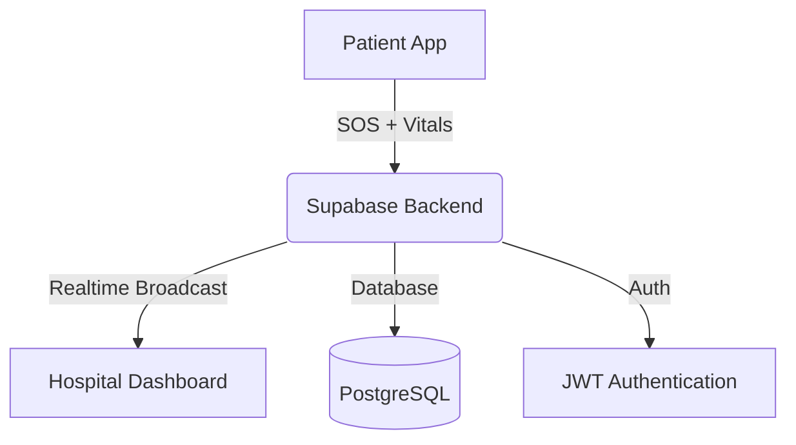

# 🚑 RES-Q: IoT-Enabled Critical Emergency Response Ecosystem

> A mission-critical mobile infrastructure designed to minimize the **Golden Hour** response time in medical emergencies.

---

## 🚀 The Core Problem

Conventional emergency response systems rely heavily on **voice calls**, which suffer from:

* Delays in response time
* Inaccurate location tracking
* Lack of real-time clinical data

**RES-Q solves this** by introducing a **data-driven "Push" model**, where hospitals receive:

* 📍 Patient location
* ❤️ Live vitals
* 🚨 Emergency type

➡️ *Before the patient even arrives*

---

## 🛠 Features

### 📡 For Patients (User App)

* **🚨 Multi-Vector SOS**
  Categorized emergency triggers:

  * Cardiac
  * Accident
  * Pregnancy
    → Enables **targeted hospital routing**

* **📍 Dynamic Radar**
  Real-time distance calculation using the **Haversine formula**
  → Finds specialized centers within a **25km radius**

* **🧭 Smart Navigation**
  Deep-linking to:

  * Google Maps
  * Apple Maps
    → Enables **self-navigation instantly**

* **🔐 Persistence**

  * Secure authentication
  * Persistent sessions using **AsyncStorage**

---

### 🏥 For Hospitals (Command Center)

* **🔊 High-Priority Acoustic Alerts**

  * Custom emergency alarms
  * Works even in **background states** using `expo-av`

* **📊 Live IoT Vitals Monitor**

  * Real-time Heart Rate (BPM)
  * SpO2 monitoring
  * Built using:

    * `react-native-chart-kit`
    * WebSockets

* **🚑 Resource Orchestration**

  * Ambulance fleet management
  * Medical staff coordination

* **🏥 Capability Management**

  * Dynamic database sync
  * Specializations like:

    * Trauma
    * Maternity

---

## 🏗 System Architecture

**Serverless Realtime Architecture**



---

## 💻 Tech Stack

| Layer          | Technology                      |
| -------------- | ------------------------------- |
| **Framework**  | React Native (Expo SDK 53)      |
| **Navigation** | Expo Router (File-based)        |
| **Backend**    | Supabase (Realtime, Auth, DB)   |
| **Database**   | PostgreSQL                      |
| **Charts**     | React Native Chart Kit          |
| **Audio**      | Expo AV                         |
| **Build Tool** | EAS (Expo Application Services) |

---

## 📦 Installation & Setup

### ✅ Prerequisites

* Node.js (v18+)
* Expo Go *(or Development Build for full features)*
* Supabase Project

---

### ⚙️ Setup Instructions

#### 1️⃣ Clone the Repository

```bash
git clone https://github.com/udaywasu/resq.git
cd resq
```

#### 2️⃣ Install Dependencies

```bash
npm install
```

#### 3️⃣ Configure Environment Variables

Create file:

```
src/services/supabaseClient.ts
```

Add:

```ts
import { createClient } from '@supabase/supabase-js';

export const supabase = createClient(
  YOUR_SUPABASE_URL,
  YOUR_ANON_KEY
);
```

---

#### 4️⃣ Run the App

```bash
npx expo start
```

---

## 🛡 Security & Compliance

* **🔒 Row Level Security (RLS)**
  Ensures hospitals only access their own data

* **🧾 Authentication**
  JWT-based secure sessions

* **💾 Data Persistence**
  Encrypted local storage

---

## 🌟 Key Highlights

* ⚡ Real-time SOS broadcasting (milliseconds latency)
* 📡 IoT-integrated vitals streaming
* 🏥 Smart hospital routing
* 🚑 Emergency fleet coordination

---

## 🧠 Future Improvements

* AI-based emergency prediction
* Wearable device integration
* Offline emergency fallback system
* Government emergency API integration

---

## 🤝 Contributing

Contributions are welcome!
Feel free to fork the repo and submit a PR 🚀

---

## 📌 Pro Tip (GitHub Optimization)

After uploading your repo, add these **Topics**:

```
react-native
supabase
iot
emergency-response
health-tech
```

---

## 📄 License

MIT License © 2026

> 💡 *"Saving time is saving lives — RES-Q is built for both."*
